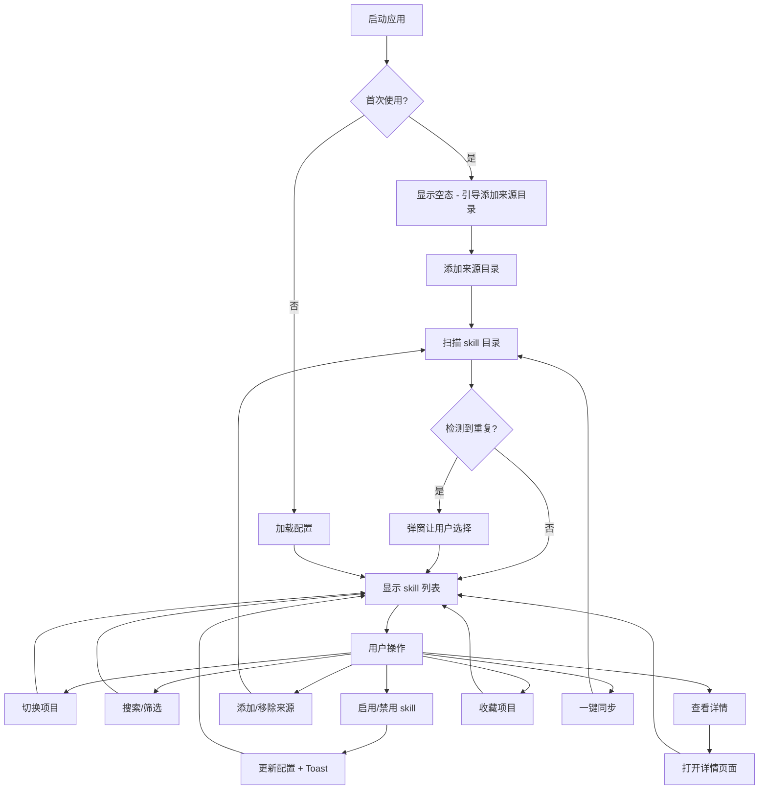

# 产品需求文档：SkillDock - V1.0

## 1. 综述 (Overview)

### 1.1 项目背景与核心问题

**背景：**
- 用户的 skill 分散存放在多个目录（~/.claude/skills/、/Users/mac/Documents/Claude/skills/common、superpowers、mini-agent 等）
- 不同项目需要不同的 skill，但目前无法按项目隔离
- 全局 skill 太多，不便于管理和查找

**核心问题：**
- skill 分散且无统一管理
- 缺乏按项目隔离的能力
- 缺乏可视化界面预览和配置

### 1.2 核心业务流程 / 用户旅程地图

1. **阶段一：技能仓库管理** - 配置来源目录，扫描并加载 skill
2. **阶段二：技能配置** - 启用/禁用 skill
3. **阶段三：项目配置** - 添加项目，配置项目的 skill，收藏项目
4. **阶段四：界面交互** - 搜索/筛选，一键同步

### 1.3 Mermaid 图（流程/状态/时序）

#### 1.3.1 用户操作流（必填）


## 2. 用户故事详述 (User Stories)

### 阶段一：技能仓库管理

---

#### **US-01: 添加来源目录**
*   **价值陈述 (Value Statement)**:
    *   **作为** 用户
    *   **我希望** 能够添加 skill 来源目录
    *   **以便于** 统一管理分散在多处的 skill
*   **业务规则与逻辑 (Business Logic)**:
    1.  **前置条件**: 无
    2.  **操作流程 (Happy Path)**:
        - 用户点击"添加来源"按钮
        - 系统弹出系统文件选择器（Finder 对话框）
        - 用户选择目录
        - 系统扫描目录，找出所有包含 SKILL.md 的子目录
        - 检测到同名 skill 时，弹窗让用户选择保留策略
        - 添加成功，显示 Toast 提示
    3.  **异常处理 (Error Handling)**:
        - 目录已达上限（10个）：提示"已达到最大数量限制（10个），无法继续添加"
        - 目录不存在：提示"目录不存在，请检查路径是否正确"
        - 目录已存在：提示已存在，阻止添加
        - 取消选择：无操作，关闭对话框
*   **验收标准 (Acceptance Criteria)**:
    *   **场景1: 添加成功**
        *   GIVEN 用户点击添加按钮并选择有效目录
        *   WHEN 目录添加成功
        *   THEN 显示 Toast "已添加 XX 目录，找到 X 个 skill"，列表显示这些 skill
    *   **场景2: 目录已达上限**
        *   GIVEN 已添加 10 个来源目录
        *   WHEN 用户点击添加按钮
        *   THEN 显示提示"已达到最大数量限制（10个），无法继续添加"
    *   **场景3: 检测到重复 skill**
        *   GIVEN 添加的目录中有同名 skill
        *   WHEN 扫描完成后
        *   THEN 弹窗显示同名 skill 列表，让用户选择处理方式（保留现有/替换/全部保留/全部替换）
*   **页面布局线框图 (ASCII Wireframe)**:
    ```text
    +------------------------------------------+
    |  [+ 添加来源]                            |
    +------------------------------------------+
    |  选择处理方式:                            |
    |  ○ 保留现有                              |
    |  ○ 替换为新的                            |
    |  ○ 全部保留旧的                          |
    |  ○ 全部用新的                            |
    |                                          |
    |  [取消]  [确认]                          |
    +------------------------------------------+
    ```

---

#### **US-02: 扫描并加载 skill**
*   **价值陈述 (Value Statement)**:
    *   **作为** 用户
    *   **我希望** 应用能够自动扫描并加载所有来源目录的 skill
    *   **以便于** 查看和管理所有可用的 skill
*   **业务规则与逻辑 (Business Logic)**:
    1.  **前置条件**: 至少添加了一个来源目录
    2.  **操作流程 (Happy Path)**:
        - 应用启动时自动扫描所有来源目录
        - 找出所有包含 SKILL.md 的子目录作为 skill
        - 读取 SKILL.md 的 description 字段作为描述
        - 显示 skill 列表
    3.  **异常处理 (Error Handling)**:
        - 某个来源目录扫描失败：跳过该目录，显示错误提示，继续扫描其他
        - SKILL.md 不存在：跳过该目录
*   **验收标准 (Acceptance Criteria)**:
    *   **场景1: 加载成功**
        *   GIVEN 已添加来源目录
        *   WHEN 应用启动
        *   THEN 自动扫描，显示 skill 列表
    *   **场景2: 部分目录加载失败**
        *   GIVEN 多个来源目录，其中一个无法访问
        *   WHEN 扫描完成后
        *   THEN 显示成功部分的 skill + 错误提示"XX 目录无法访问"
    *   **场景3: 无 SKILL.md**
        *   GIVEN 某个子目录没有 SKILL.md
        *   WHEN 扫描时
        *   THEN 跳过该目录，不显示

---

#### **US-03: 移除来源目录**
*   **价值陈述 (Value Statement)**:
    *   **作为** 用户
    *   **我希望** 能够移除不再需要的来源目录
    *   **以便于** 管理我的 skill 来源列表
*   **业务规则与逻辑 (Business Logic)**:
    1.  **前置条件**: 至少添加了一个来源目录
    2.  **操作流程 (Happy Path)**:
        - 用户点击来源目录旁的删除按钮
        - 弹出确认提示
        - 用户确认后，移除该目录
        - 该目录下的 skill 从列表中移除
    3.  **异常处理 (Error Handling)**:
        - 目录已不存在：从配置中移除，提示"该目录已不存在，已从配置中移除"
        - 用户取消：无操作，关闭确认框
*   **验收标准 (Acceptance Criteria)**:
    *   **场景1: 移除成功**
        *   GIVEN 用户点击删除并确认
        *   WHEN 移除成功
        *   THEN 目录从列表移除，相关 skill 不再显示
    *   **场景2: 用户取消**
        *   GIVEN 用户点击删除后选择取消
        *   WHEN 用户取消操作
        *   THEN 无任何变化

---

#### **US-04: 查看 skill 详情**
*   **价值陈述 (Value Statement)**:
    *   **作为** 用户
    *   **我希望** 能够查看某个 skill 的详细信息
    *   **以便于** 了解 skill 的用途和功能
*   **业务规则与逻辑 (Business Logic)**:
    1.  **前置条件**: skill 列表中有至少一个 skill
    2.  **操作流程 (Happy Path)**:
        - 用户点击 skill 卡片上的"详情"按钮
        - 系统打开新页面，显示 skill 详情
        - 详情包含：名称、description 完整内容、来源目录路径
        - 用户可右键点击"在 Finder 中显示"打开目录
    3.  **异常处理 (Error Handling)**:
        - 无
*   **验收标准 (Acceptance Criteria)**:
    *   **场景1: 查看详情**
        *   GIVEN skill 列表中有 skill
        *   WHEN 用户点击详情按钮
        *   THEN 打开新页面显示完整信息
    *   **场景2: 在 Finder 中显示**
        *   GIVEN 用户右键点击
        *   WHEN 选择"在 Finder 中显示"
        *   THEN 打开该 skill 目录
    *   **场景3: 关闭详情页面**
        *   GWEI 用户点击 X 按钮
        *   THEN 关闭详情页面
    *   **页面布局线框图 (ASCII Wireframe)**:
        ```text
        +------------------------------------------+
        |  ×                                       |
        +------------------------------------------+
        |  🧠 brainstorming                         |
        |                                          |
        |  Description:                            |
        |  帮助把想法变成完整的设计和规格，        |
        |  通过结构化对话梳理需求...               |
        |                                          |
        |  来源目录:                                |
        |  ~/.claude/skills/brainstorming          |
        |                                          |
        |  [在 Finder 中显示]                      |
        +------------------------------------------+
        ```

---

### 阶段二：技能配置

---

#### **US-06: 启用/禁用 skill**
*   **价值陈述 (Value Statement)**:
    *   **作为** 用户
    *   **我希望** 能够启用或禁用某个 skill
    *   **以便于** 控制哪些 skill 可以被 Claude Code 调用
*   **业务规则与逻辑 (Business Logic)**:
    1.  **前置条件**: skill 列表中有至少一个 skill
    2.  **操作流程 (Happy Path)**:
        - 用户点击 skill 卡片的 toggle 开关
        - 启用：标记为启用状态
        - 禁用：移除启用标记
        - 自动保存配置
    3.  **异常处理 (Error Handling)**:
        - 无
*   **验收标准 (Acceptance Criteria)**:
    *   **场景1: 启用 skill**
        *   GIVEN 用户关闭某个 skill
        *   WHEN 用户点击 toggle 开启
        *   THEN 该 skill 标记为启用，配置文件更新
    *   **场景2: 禁用 skill**
        *   GIVEN 用户开启某个 skill
        *   WHEN 用户点击 toggle 关闭
        *   THEN 该 skill 标记为禁用，配置文件更新

---

### 阶段三：项目配置

---

#### **US-08: 添加项目**
*   **价值陈述 (Value Statement)**:
    *   **作为** 用户
    *   **我希望** 能够添加项目目录
    *   **以便于** 为不同项目配置不同的 skill
*   **业务规则与逻辑 (Business Logic)**:
    1.  **前置条件**: 无
    2.  **操作流程 (Happy Path)**:
        - 用户点击"添加项目"按钮
        - 系统弹出系统文件选择器
        - 用户选择目录
        - 添加成功，在项目列表显示
    3.  **异常处理 (Error Handling)**:
        - 项目已存在：提示已存在，阻止添加
*   **验收标准 (Acceptance Criteria)**:
    *   **场景1: 添加成功**
        *   GIVEN 用户点击添加项目并选择有效目录
        *   WHEN 添加成功
        *   THEN 项目显示在列表中
    *   **场景2: 项目已存在**
        *   GIVEN 用户选择已存在的项目目录
        *   WHEN 添加时
        *   THEN 提示"该项目已存在"

---

#### **US-09: 切换项目**
*   **价值陈述 (Value Statement)**:
    *   **作为** 用户
    *   **我希望** 能够切换不同的项目
    *   **以便于** 查看和编辑不同项目的 skill 配置
*   **业务规则与逻辑 (Business Logic)**:
    1.  **前置条件**: 已添加至少一个项目
    2.  **操作流程 (Happy Path)**:
        - 用户点击左侧项目列表中的某个项目
        - 右侧内容区切换为该项目配置
        - 自动保存之前项目的配置
    3.  **异常处理 (Error Handling)**:
        - 项目目录已不存在：提示"项目目录不存在"，从列表移除
*   **验收标准 (Acceptance Criteria)**:
    *   **场景1: 切换成功**
        *   GIVEN 已在项目列表添加项目
        *   WHEN 用户点击切换项目
        *   THEN 右侧显示该项目的 skill 配置
    *   **场景2: 项目目录不存在**
        *   GIVEN 某项目目录已被删除
        *   WHEN 切换到该项目时
        *   THEN 提示"项目目录不存在"并移除

---

#### **US-10: 项目配置 skill**
*   **价值陈述 (Value Statement)**:
    *   **作为** 用户
    *   **我希望** 能够为项目启用或禁用 skill
    *   **以便于** 实现项目级别的 skill 隔离
*   **业务规则与逻辑 (Business Logic)**:
    1.  **前置条件**: 已添加项目
    2.  **操作流程 (Happy Path)**:
        - 用户切换到某个项目
        - 右侧显示该项目的 skill 列表
        - 用户通过 toggle 启用/禁用 skill
        - 自动保存
    3.  **异常处理 (Error Handling)**:
        - 无
*   **验收标准 (Acceptance Criteria)**:
    *   **场景1: 配置 skill**
        *   GIVEN 用户在项目视图中
        *   WHEN 用户点击 toggle
        *   THEN 更新该项目的 skill 配置，配置文件保存到项目目录
    *   **页面布局线框图 (ASCII Wireframe)**:
        ```text
        +------------------------------------------+
        |  📁 SkillDock                         |
        +------------------------------------------+
        |  ┌────────────────────────────────────┐  |
        |  │ 🧠 brainstorming       [✓]         │  |
        |  │    头脑风暴工具                     │  |
        |  ├────────────────────────────────────┤  │
        |  │ 🎨 design-exploration [ ]          │  |
        |  │    设计探索                        │  |
        |  └────────────────────────────────────┘  |
        +------------------------------------------+
        ```

---

#### **US-11: 收藏项目**
*   **价值陈述 (Value Statement)**:
    *   **作为** 用户
    *   **我希望** 能够收藏常用项目
    *   **以便于** 快速访问常用项目
*   **业务规则与逻辑 (Business Logic)**:
    1.  **前置条件**: 已添加至少一个项目
    2.  **操作流程 (Happy Path)**:
        - 用户点击项目旁的收藏按钮
        - 项目添加到"常用项目"区域
        - 再次点击取消收藏
    3.  **异常处理 (Error Handling)**:
        - 收藏已达上限（5个）：提示"收藏已达上限（5个）"
*   **验收标准 (Acceptance Criteria)**:
    *   **场景1: 收藏成功**
        *   GIVEN 用户点击收藏按钮
        *   WHEN 收藏成功
        *   THEN 项目显示在"常用项目"区域
    *   **场景2: 取消收藏**
        *   GIVEN 用户已收藏的项目
        *   WHEN 再次点击收藏按钮
        *   THEN 从"常用项目"区域移除
    *   **场景3: 收藏已达上限**
        *   GIVEN 已收藏 5 个项目
        *   WHEN 用户点击收藏
        *   THEN 提示"收藏已达上限（5个）"

---

### 阶段四：界面交互

---

#### **US-12: 搜索/筛选 skill**
*   **价值陈述 (Value Statement)**:
    *   **作为** 用户
    *   **我希望** 能够搜索和筛选 skill
    *   **以便于** 快速找到需要的 skill
*   **业务规则与逻辑 (Business Logic)**:
    1.  **前置条件**: skill 列表中有至少一个 skill
    2.  **操作流程 (Happy Path)**:
        - 用户在搜索框输入关键词
        - 系统模糊匹配 skill 名称和 description
        - 用户可通过下拉菜单按来源目录筛选
        - 搜索和筛选条件为 AND 关系
    3.  **异常处理 (Error Handling)**:
        - 无匹配结果：显示空态提示
*   **验收标准 (Acceptance Criteria)**:
    *   **场景1: 搜索匹配**
        *   GIVEN skill 列表中有多个 skill
        *   WHEN 用户输入关键词
        *   THEN 显示匹配的 skill
    *   **场景2: 筛选匹配**
        *   GIVEN 用户选择来源目录筛选
        *   THEN 只显示该来源的 skill
    *   **场景3: 无匹配结果**
        *   GIVEN 搜索条件无匹配
        *   THEN 显示空态"没有找到匹配的 skill"
    *   **页面布局线框图 (ASCII Wireframe)**:
        ```text
        +------------------------------------------+
        |  🔍 搜索...           [来源目录 ▼]       |
        +------------------------------------------+
        |  ┌────────────────────────────────────┐  |
        |  │ 🧠 brainstorming       [✓]         │  |
        │  └────────────────────────────────────┘  |
        +------------------------------------------+
        ```

---

#### **US-14: 一键同步**
*   **价值陈述 (Value Statement)**:
    *   **作为** 用户
    *   **我希望** 能够一键同步已添加目录中的新 skill
    *   **以便于** 更新 skill 列表
*   **业务规则与逻辑 (Business Logic)**:
    1.  **前置条件**: 已添加来源目录
    2.  **操作流程 (Happy Path)**:
        - 用户点击"一键同步"按钮
        - 系统显示 loading 状态
        - 扫描所有已添加的目录
        - 检测新增的 skill
        - 检测到重复时弹窗让用户选择
        - 完成后提示"新增 X 个 skill"
    3.  **异常处理 (Error Handling)**:
        - 扫描失败：显示部分成功提示
*   **验收标准 (Acceptance Criteria)**:
    *   **场景1: 同步成功**
        *   GIVEN 已添加来源目录
        *   WHEN 用户点击一键同步
        *   THEN 显示 loading，完成后提示"新增 X 个 skill"
    *   **场景2: 检测到重复**
        *   GIVEN 同步时发现同名 skill
        *   THEN 弹窗让用户选择处理方式

---

## 3. 非功能需求 (Non-Functional Requirements)

- **性能**: 应用启动时间 < 2 秒，扫描 100 个 skill < 5 秒
- **兼容性**: 支持 macOS 12.0+
- **存储**: 配置文件使用 JSON 格式，存放在项目目录（.skills-config.json）
- **无障碍**: 支持 VoiceOver

---

## 4. 术语表 (Glossary)

| 术语 | 定义 |
|------|------|
| Skill | AI 工具的技能包，包含 SKILL.md 描述文件 |
| 来源目录 | 存放 skill 的根目录 |
| 项目 | 用户的工作目录，用于隔离不同项目的 skill 配置 |
| Skills仓库 | 所有来源目录的 skill 汇总 |

---

## 5. 附录 (Appendix)

### 5.1 Skill 来源目录

| 来源 | 路径 |
|------|------|
| 全局 | ~/.claude/skills/ |
| common | /Users/mac/Documents/Claude/skills/common |
| superpowers | /Users/mac/Documents/Claude/skills/superpowers |
| mini-agent | /Users/mac/Documents/Claude/mini-agent/skills |

### 5.2 配置文件结构

```json
{
  "version": "1.0",
  "sources": [
    {
      "path": "/path/to/skills",
      "addedAt": "2025-01-01T00:00:00Z"
    }
  ],
  "projects": [
    {
      "path": "/path/to/project",
      "name": "project-name",
      "favorite": true,
      "skills": {
        "brainstorming": true,
        "design-exploration": false
      }
    }
  ]
}
```

---

*文档创建日期: 2025-02-24*
*版本: V1.0*
