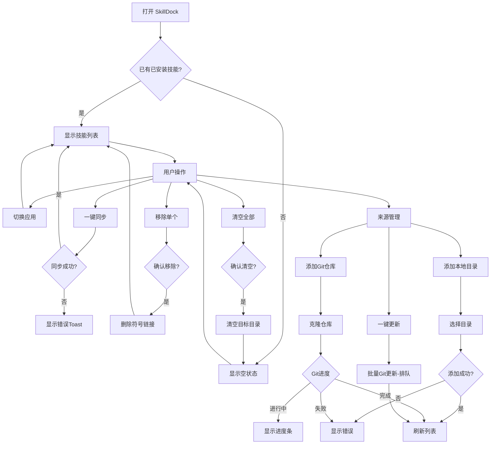

# 产品需求文档：SkillDock V1.3 功能优化

## 1. 综述 (Overview)

### 1.1 项目背景与核心问题

v1.2 上线后，用户反馈以下体验问题：

1. **Git 操作阻塞 UI**：添加/更新 Git 仓库时会弹窗等待，阻塞用户操作
2. **技能列表展示逻辑不符心智**：切换到某应用后，显示所有来源的 skill，而非该应用已安装的 skill
3. **开关组件语义错误**：调研确认 `settings.json` 的 `Skills:` 权限配置对 Skill 无效，关闭开关不会真正禁用 skill
4. **交互细节需优化**：侧边栏 hover 切换误触，转场动画卡顿

### 1.2 核心业务流程 / 用户旅程地图

1.  **阶段一：首次访问** - 展示空状态，引导用户同步
2.  **阶段二：管理来源** - 添加/删除本地目录或 Git 仓库
3.  **阶段三：安装技能** - 一键同步、移除单个、清空全部
4.  **阶段四：交互优化** - 应用切换优化、移除主题设置

### 1.3 Mermaid 图（流程/状态/时序）

#### 1.3.1 用户操作流（必填）



## 2. 用户故事详述 (User Stories)

### 阶段一：首次访问

---

#### **US-01: 查看空状态引导**

*   **价值陈述 (Value Statement)**:
    *   **作为** 用户
    *   **我希望** 首次打开应用或清空全部后，看到明确的引导
    *   **以便于** 知道如何开始安装技能
*   **业务规则与逻辑 (Business Logic)**:
    1.  **前置条件**: 当前应用目录下无已安装的 skill
    2.  **操作流程 (Happy Path)**:
        - 显示空状态：居中图标 + 文案 + 「一键同步」按钮
        - 空状态不显示「清空全部」按钮
        - 点击「一键同步」后执行同步流程
    3.  **异常处理 (Error Handling)**:
        - 无异常处理场景
*   **验收标准 (Acceptance Criteria)**:
    *   **场景1: 首次访问显示空状态**
        *   **GIVEN** 打开 SkillDock，当前应用无已安装 skill
        *   **WHEN** 查看技能列表
        *   **THEN** 显示空状态，包含图标、「暂无已安装的 Skill」文案、「一键同步」按钮，不显示「清空全部」按钮
    *   **场景2: 点击一键同步**
        *   **GIVEN** 处于空状态
        *   **WHEN** 点击「一键同步」按钮
        *   **THEN** 执行同步流程，跳转到技能列表（显示已安装的 skill）
*   **页面布局线框图 (ASCII Wireframe)**:
    ```text
    ┌────────────────────────────────────────────────────────────┐
    │  Claude Code - Skills                        [清空] [同步]│
    │  ─────────────────────────────────────────────────────── │
    │                                                            │
    │              ┌───────────────────────┐                    │
    │              │                       │                    │
    │              │         📭            │  ← 空状态图标      │
    │              │                       │                    │
    │              │  暂无已安装的 Skill   │  ← 引导文案        │
    │              │                       │                    │
    │              │  点击「一键同步」从    │                    │
    │              │  来源目录安装 Skill   │                    │
    │              │                       │                    │
    │              │    [一键同步]         │  ← 唯一按钮        │
    │              └───────────────────────┘                    │
    │                                                            │
    └────────────────────────────────────────────────────────────┘
    ```

---

### 阶段二：管理来源

---

#### **US-02: 添加本地目录**

*   **价值陈述 (Value Statement)**:
    *   **作为** 用户
    *   **我希望** 添加本地目录作为技能来源
    *   **以便于** 管理多个技能来源
*   **业务规则与逻辑 (Business Logic)**:
    1.  **前置条件**: 用户位于来源管理页面
    2.  **操作流程 (Happy Path)**:
        - 点击「+ 添加目录」按钮
        - 打开系统 NSOpenPanel 目录选择器
        - 用户选择目录后添加到来源列表
        - 自动扫描该目录并刷新
    3.  **异常处理 (Error Handling)**:
        - 用户取消选择：不做任何操作
        - 选择的目录不存在：显示错误 Toast
        - 选择的目录无读取权限：显示错误 Toast
*   **验收标准 (Acceptance Criteria)**:
    *   **场景1: 成功添加目录**
        *   **GIVEN** 用户在来源管理页
        *   **WHEN** 点击「+ 添加目录」并选择有效目录
        *   **THEN** 目录添加到本地目录列表，显示在列表中
    *   **场景2: 取消添加**
        *   **GIVEN** 用户在 NSOpenPanel 中
        *   **WHEN** 点击取消
        *   **THEN** 来源列表无变化
*   **页面布局线框图 (ASCII Wireframe)**:
    ```text
    ┌────────────────────────────────────────────────────────────┐
    │  来源管理                                                │
    │  ─────────────────────────────────────────────────────── │
    │                                                            │
    │  本地目录                               [+ 添加目录]      │
    │  ┌──────────────────────────────────────────────────────┐  │
    │  │ 📁  ~/.claude/skills              [删除]           │  │
    │  └──────────────────────────────────────────────────────┘  │
    │  ┌──────────────────────────────────────────────────────┐  │
    │  │ 📁  ~/Documents/MySkills           [删除]           │  │
    │  └──────────────────────────────────────────────────────┘  │
    │                                                            │
    │  ─────────────────────────────────────────────────────── │
    │                                                            │
    │  Git 仓库                                  [+ 添加仓库]   │
    │  ┌──────────────────────────────────────────────────────┐  │
    │  │ 📦  farion1231/browser-use         [删除]           │  │
    │  └──────────────────────────────────────────────────────┘  │
    │                                                            │
    └────────────────────────────────────────────────────────────┘
    ```

---

#### **US-03: 添加 Git 仓库**

*   **价值陈述 (Value Statement)**:
    *   **作为** 用户
    *   **我希望** 添加 Git 仓库作为技能来源
    *   **以便于** 从远程仓库获取技能
*   **业务规则与逻辑 (Business Logic)**:
    1.  **前置条件**: 用户位于来源管理页面
    2.  **操作流程 (Happy Path)**:
        - 点击「+ 添加仓库」按钮
        - 弹出输入框，用户输入 Git URL（支持 HTTPS/SSH）
        - 后台执行 git clone，不阻塞 UI
        - 在 Git 仓库模块内显示克隆进度条
        - 克隆完成后刷新来源列表
    3.  **异常处理 (Error Handling)**:
        - Git URL 无效：显示错误 Toast
        - 网络超时：显示错误 Toast，保留重试入口
        - 仓库已存在：显示警告 Toast
*   **验收标准 (Acceptance Criteria)**:
    *   **场景1: 克隆成功**
        *   **GIVEN** 用户输入有效的 Git URL 并点击添加
        *   **WHEN** git clone 执行中
        *   **THEN** Git 仓库模块内显示进度条，添加按钮禁用，不弹窗等待
    *   **场景2: 克隆失败**
        *   **GIVEN** git clone 执行失败
        *   **WHEN** 克隆完成（失败）
        *   **THEN** 显示错误 Toast，保留重试入口

---

#### **US-04: 一键更新 Git 仓库（排队机制）**

*   **价值陈述 (Value Statement)**:
    *   **作为** 用户
    *   **我希望** 批量更新所有 Git 仓库
    *   **以便于** 获取最新技能
*   **业务规则与逻辑 (Business Logic)**:
    1.  **前置条件**: 存在至少一个 Git 来源
    2.  **操作流程 (Happy Path)**:
        - 点击「↻ 一键更新」按钮
        - 排队机制：一个一个执行 git pull
        - 更新过程在后台静默执行，不阻塞应用正常使用
        - 全部完成后显示 Toast 通知
    3.  **异常处理 (Error Handling)**:
        - 单个仓库更新失败：跳过继续下一个，最后报告失败数量
        - 网络超时：标记为失败，继续下一个
*   **验收标准 (Acceptance Criteria)**:
    *   **场景1: 批量更新成功**
        *   **GIVEN** 存在多个 Git 仓库来源
        *   **WHEN** 点击「一键更新」
        *   **THEN** 逐个执行 git pull，更新过程不阻塞 UI，全部完成后显示成功 Toast
    *   **场景2: 部分失败**
        *   **GIVEN** 存在多个 Git 仓库，其中某个更新失败
        *   **WHEN** 一键更新执行中
        *   **THEN** 跳过失败的仓库继续执行下一个，最后显示「更新完成，X 个失败」

---

#### **US-05: 删除来源**

*   **价值陈述 (Value Statement)**:
    *   **作为** 用户
    *   **我希望** 删除不需要的来源
    *   **以便于** 精简来源列表
*   **业务规则与逻辑 (Business Logic)**:
    1.  **前置条件**: 存在至少一个来源
    2.  **操作流程 (Happy Path)**:
        - Hover 来源项，显示删除按钮
        - 点击删除按钮，弹出二次确认框
        - 确认后删除来源
        - **已安装的 skill 保留**（不删除目标目录的符号链接）
    3.  **异常处理 (Error Handling)**:
        - 无异常处理场景
*   **验收标准 (Acceptance Criteria)**:
    *   **场景1: 删除来源**
        *   **GIVEN** 存在一个本地目录来源
        *   **WHEN** 点击删除并确认
        *   **THEN** 来源从列表移除，已安装的 skill 保留在目标目录
    *   **场景2: 取消删除**
        *   **GIVEN** 点击删除按钮
        *   **WHEN** 在确认框中点击取消
        *   **THEN** 来源列表无变化

---

### 阶段三：安装技能

---

#### **US-06: 一键同步**

*   **价值陈述 (Value Statement)**:
    *   **作为** 用户
    *   **我希望** 一键将所有来源的 skill 同步到当前应用
    *   **以便于** 快速安装/更新技能
*   **业务规则与逻辑 (Business Logic)**:
    1.  **前置条件**: 用户在技能列表页
    2.  **操作流程 (Happy Path)**:
        - 点击「一键同步」按钮
        - 扫描所有来源目录
        - 与目标应用目录对比，计算差异（新增/移除/冲突）
        - 无冲突时直接执行同步
        - 有冲突时显示冲突预览，用户选择策略后执行
        - 同步完成后刷新列表，显示已安装的 skill
    3.  **异常处理 (Error Handling)**:
        - 目标目录无写权限：显示错误 Toast，跳过无法写入的项
        - 符号链接失败：显示警告 Toast，跳过该项
*   **验收标准 (Acceptance Criteria)**:
    *   **场景1: 同步成功**
        *   **GIVEN** 存在多个来源
        *   **WHEN** 点击「一键同步」
        *   **THEN** 按钮显示同步中，完成后刷新列表，显示 Toast「同步完成：新增 X 个」
    *   **场景2: 部分失败**
        *   **GIVEN** 存在无法写入的 skill
        *   **WHEN** 同步执行中
        *   **THEN** 显示警告 Toast「已跳过 X 个」

---

#### **US-07: 移除单个技能**

*   **价值陈述 (Value Statement)**:
    *   **作为** 用户
    *   **我希望** 移除不需要的技能
    *   **以便于** 只保留常用的技能
*   **业务规则与逻辑 (Business Logic)**:
    1.  **前置条件**: 技能列表中存在至少一个 skill
    2.  **操作流程 (Happy Path)**:
        - 点击技能卡片的「移除」按钮
        - 弹出确认框，显示 skill 名称
        - 确认后删除目标应用目录下该 skill 的符号链接
        - 刷新列表，显示 Toast 通知
    3.  **异常处理 (Error Handling)**:
        - 符号链接不存在：静默忽略
*   **验收标准 (Acceptance Criteria)**:
    *   **场景1: 移除成功**
        *   **GIVEN** 技能列表中有 skill
        *   **WHEN** 点击「移除」并确认
        *   **THEN** skill 从列表中移除，显示 Toast「已移除 XXX」
    *   **场景2: 取消移除**
        *   **GIVEN** 点击「移除」按钮
        *   **WHEN** 在确认框中点击取消
        *   **THEN** 列表无变化

---

#### **US-08: 清空全部技能**

*   **价值陈述 (Value Statement)**:
    *   **作为** 用户
    *   **我希望** 一键清空当前应用的所有已安装技能
    *   **以便于** 重新开始或清理环境
*   **业务规则与逻辑 (Business Logic)**:
    1.  **前置条件**: 当前应用有已安装的 skill
    2.  **操作流程 (Happy Path)**:
        - 点击「清空全部」按钮（仅在有 skill 时显示）
        - 弹出确认框，**明确说明会删除历史遗留的 skill**
        - 确认后遍历目标目录，删除所有子项（不管是否来源于 SkillDock）
        - 切换到空状态
    3.  **异常处理 (Error Handling)**:
        - 部分文件无法删除：跳过并显示警告
*   **验收标准 (Acceptance Criteria)**:
    *   **场景1: 清空成功**
        *   **GIVEN** 当前应用有多个已安装 skill
        *   **WHEN** 点击「清空全部」并确认
        *   **THEN** 目标目录清空，切换到空状态，显示 Toast「已清空」
    *   **场景2: 取消清空**
        *   **GIVEN** 点击「清空全部」按钮
        *   **WHEN** 在确认框中点击取消
        *   **THEN** 列表无变化
    *   **场景3: 空状态不显示清空按钮**
        *   **GIVEN** 当前应用无已安装 skill（空状态）
        *   **WHEN** 查看技能列表
        *   **THEN** 不显示「清空全部」按钮

---

### 阶段四：交互优化

---

#### **US-09: 切换应用**

*   **价值陈述 (Value Statement)**:
    *   **作为** 用户
    *   **我希望** 点击侧边栏切换到不同应用的技能列表
    *   **以便于** 管理多个应用的技能
*   **业务规则与逻辑 (Business Logic)**:
    1.  **前置条件**: 侧边栏存在多个应用
    2.  **操作流程 (Happy Path)**:
        - 用户**点击**侧边栏应用项（非 hover）
        - 读取目标应用目录，获取已安装的 skill
        - 显示加载态（禁止交互）
        - 切换后展示该应用的技能列表
        - 使用简单淡入淡出或直接切换，避免卡顿
    3.  **异常处理 (Error Handling)**:
        - 目标目录不存在：创建空目录，显示空状态
*   **验收标准 (Acceptance Criteria)**:
    *   **场景1: 切换应用**
        *   **GIVEN** 在 Claude Code 技能列表
        *   **WHEN** 点击侧边栏的 Codex
        *   **THEN** 切换到 Codex 的技能列表，动画流畅无卡顿
    *   **场景2: 空目录**
        *   **GIVEN** 目标应用目录为空
        *   **WHEN** 切换到该应用
        *   **THEN** 显示空状态

---

#### **US-10: 移除主题设置**

*   **价值陈述 (Value Statement)**:
    *   **作为** 用户
    *   **我希望** 移除主题设置功能
    *   **以便于** 简化产品功能
*   **业务规则与逻辑 (Business Logic)**:
    1.  **前置条件**: 无
    2.  **操作流程 (Happy Path)**:
        - 移除设置页的主题选择功能
        - 应用默认跟随系统主题
    3.  **异常处理 (Error Handling)**:
        - 无
*   **验收标准 (Acceptance Criteria)**:
    *   **场景1: 移除主题设置**
        *   **GIVEN** 存在设置页面
        *   **WHEN** 查看设置页
        *   **THEN** 不再显示主题选择选项

---

## 3. 设计稿

| 文件 | 路径 |
|------|------|
| 主设计稿 | `设计/v1.3-SkillDock/01-设计稿.html` |
| 全状态参考 | `设计/v1.3-SkillDock/02-全状态设计参考.html` |
| 用户旅程图 | `设计/v1.3-SkillDock/user-journey.mmd` |

---

## 4. 技术约束

### 4.1 各应用 skills 目录

| 应用 | 目录 |
|------|------|
| Claude Code | `~/.claude/skills` |
| Codex | `~/.codex/skills` |
| OpenCode | `~/.config/opencode/skills` |
| Trae | `~/.trae/skills` |
| Trae CN | `~/.trae-cn/skills` |

### 4.2 同步策略

- 符号链接优先
- 失败时显示错误（不回退复制）
- 清理历史托管链接

### 4.3 权限说明

- `settings.json` 的 `Skills:` 权限配置对 Skill **无效**
- 必须从文件系统层面控制：删除符号链接 = 真正移除 skill
